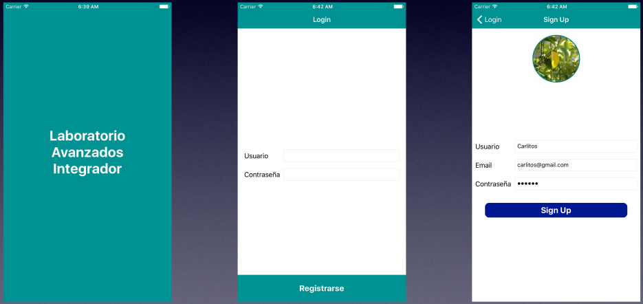
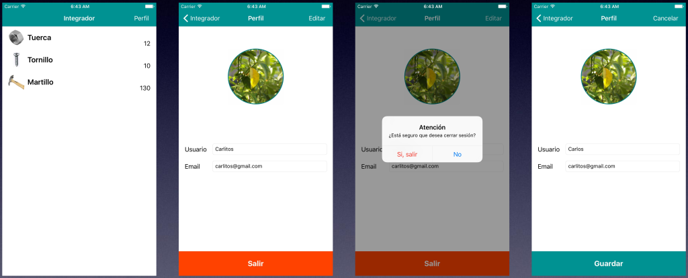

# Laboratorio 5
## Laboratorio avanzado integrador

* Registrarse con nombre, mail, password y foto. Almacenar localmente le
usuario registrado.
* Ingresar, contrastando nombre y password ingresados vs nombre y
password registrados.
* Mostrar los errores que correspondan (campos vacíos, mal formato de mail,
etc.).
* Si el login es exitoso, mostrar la lista de productos con fotos. Se almacena
localmente que el usuario se logueo, para que la próxima vez que entre no
tenga que foguearse.
* Los productos pueden venir desde un json local o desde el servicio web de
la clase de contenido remoto. Puedo compilar una versión que use el json
(para pruebas) y otra versión que baja al servicio Rest.
* Desde la lista de productos (la home de la app) puedo acceder al perfil del usuario, donde
veo nombre, email y foto. Desde ahí puedo desbloquearme o editar el perfil.
* Si hago tap sobre editar, entro en modo de edición: los textfields se hacen evitables y si
hago tap sobre la foto al puedo cambiar. Si no estoy en modo de edición, lo único que
puedo hacer es desloguearme. Si hago tap sobre un textfield o sobre la foto, no los voy a
poder editar.
* Si hago algún cambio (nombre, email o foto) y hago tap en guardar, los datos del usuario
almacenados localmente cambian. La próxima vez que entre debo ver los datos
modificados.
* Si hago algún cambio (nombre, email o foto) y hago tap en cancelar, deshecho los cambios
y veo los valores de nombre, email y foto originales.
* Si hago tap en “salir”, se muestra un alerta pidiendo al usuario que confirme que quiere
cerrar sesión. Si toca que sí, el usuario como fogueado almacenado localmente se borra y la
próxima vez que entre en la app, voy a tener que loguearme. Luego de desloguearse, se
muestra la pantalla de login.

